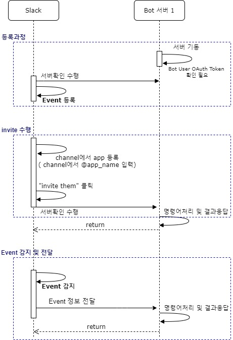
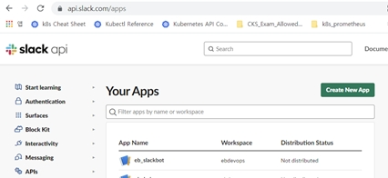
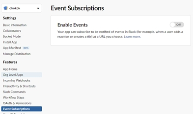
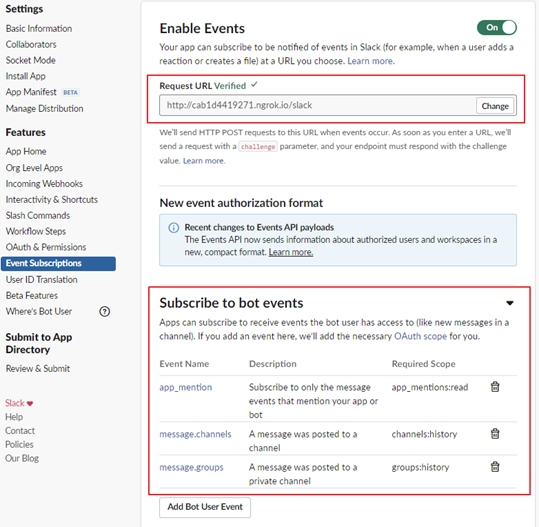

# eventProcessingBot

> eventProcessingBot 환경설정 및 수행

## 작업순서
1. 등록 및 설정
1. invite 수행
1. Event감지 및 전달




## 1. 등록 및 설정
### slack-bot 다운로드 및 실행
```sh
git clone {REPONAME}/eventProcessingBot
cd eventProcessingBot
python3 BotTest.py
```
### 서버외부에 노출하기 (ngrok 사용)
참조 : https://okdevtv.com/mib/ngrok, https://ngrok.com/
```sh
# install
npm i -g ngrok
# start 
ngrok http 8080
```

### slack app에 설정
* 관리하는 slack app으로 이동 ( https://api.slack.com/apps ) <br/>


* app 선택 후, "Event Subscriptions" 메뉴로 이동<br/>


* events 추가 <br/>
Enable Events Off --> On 으로 토글하고, Request URL을 기입하고 <br>
bot events에 app_mention, message_channels, message.groups를 추가한다<br/>


## 2. 채널에 해당 Bot을 등록한다.
### invite 수행한다. 
* 사용할 channel에서 @bot_name 으로 수행한다. (예 : @okokok )
* invite them 확인
***

## 3. Event감지 및 전달
* 채널에 문자열이 입력되면 해당 서버로 전송되는지 확인한다.
* 특정 문자열에 결과를 channnel로 리턴하는지 확인한다.
* webhook으로 특정 채널에 전달된 문자열도 처리되는지 확인한다.


***